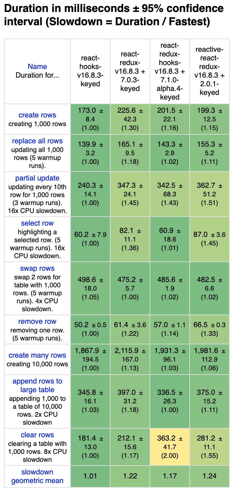
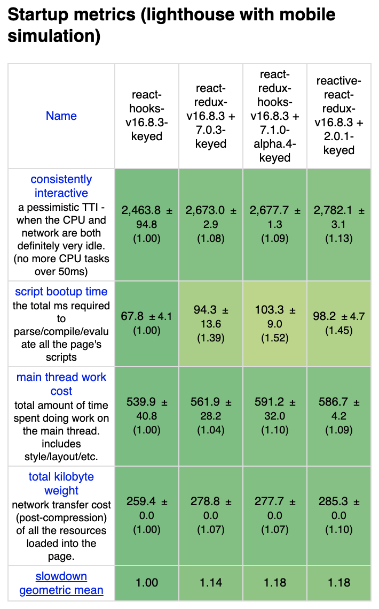
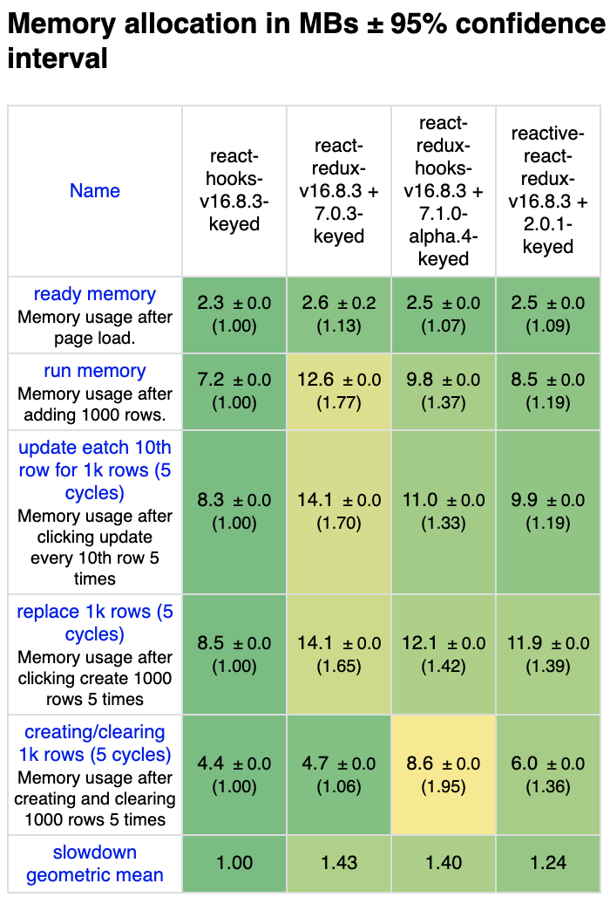

### Introduction

Recently, React Redux released hooks API. It's v7.1.0-alpha.4 as of writing.

https://github.com/reduxjs/react-redux/releases/tag/v7.1.0-alpha.4

On the other hand, I've been developing a new React Redux binding library with hooks and Proxy.

https://github.com/dai-shi/reactive-react-redux

It's time to benchmark both of them to have better understanding in performance. The reactive-react-redux library utilizes Proxy to auto-detect state usage, hence it technically has overhead which would affect performance. We would like to learn how much it will be affected in a realistic example.

As a benchmark tool, [js-framework-benchmark](https://github.com/krausest/js-framework-benchmark) is used. For comparison, bare `react-hooks` implementation and connect-based `react-redux` implementation are also included.

### Benchmark results

The following is the results of four implementations. Please refer [the tool doc](https://github.com/krausest/js-framework-benchmark#readme) for detailed information.







The `react-hooks` result is basically the best (with some exceptions) because its implementation is basic without Redux. The `react-redux-hooks` result is pretty good and sometimes better than the `react-redux` result. The `reactive-react-redux` result is mostly OK and notably it's relatively good in memory allocation.

### The code at a glance

Let's quickly look at the code. The following is from `react-redux-hooks` benchmark code.

```jsx
const Row = React.memo(({ i }) => {
  const selector = useCallback((state) => {
    const item = state.data[i];
    return state.selected === item.id ? { id: item.id, label: item.label, selected: true } : item;
  }, [i]);
  const { selected, id, label } = useSelector(selector);
  const dispatch = useDispatch();
  const onSelect = useCallback(() => {
    dispatch(select(id));
  }, [dispatch, id]);
  const onRemove = useCallback(() => {
    dispatch(remove(id));
  }, [dispatch, id]);
  return (
    <tr className={selected ? "danger" : ""}>
      <td className="col-md-1">{id}</td>
      <td className="col-md-4"><a onClick={onSelect}>{label}</a></td>
      <td className="col-md-1"><a onClick={onRemove}>{GlyphIcon}</a></td>
      <td className="col-md-6"></td>
    </tr>
  );
});

const InnerRowList = React.memo(({ data }) => {
  return data.map((item, i) => <Row key={item.id} i={i} />);
});

const RowList = () => {
  const data = useSelector(state => state.data);
  return <InnerRowList data={data} />;
};
```

You may find that it uses `React.memo` several times, which is to optimize without `connect.`

The following benchmark code is for `reactive-react-redux.`

```jsx
const Row = React.memo(({ item, selected }) => {
  const { id, label } = item;
  const dispatch = useReduxDispatch();
  const onSelect = useCallback(() => {
    dispatch(select(id));
  }, [dispatch, id]);
  const onRemove = useCallback(() => {
    dispatch(remove(id));
  }, [dispatch, id]);
  return (
    <tr className={selected ? "danger" : ""}>
      <td className="col-md-1">{id}</td>
      <td className="col-md-4"><a onClick={onSelect}>{label}</a></td>
      <td className="col-md-1"><a onClick={onRemove}>{GlyphIcon}</a></td>
      <td className="col-md-6"></td>
    </tr>
  );
});

const InnerRowList = React.memo(({ data, selectedId }) => {
  return data.map((item, i) => <Row key={item.id} item={item} selected={selectedId === item.id} />);
});

const RowList = () => {
  const state = useReduxState();
  const data = state.data;
  const selectedId = state.selected;
  return <InnerRowList data={data} selectedId={selectedId} />;
};
```

Due to the nature that `useReduxState` in reactive-react-redux doesn't take a selector, the code structure is slightly different. It passes an `item` object and a `selected` flag, instead of an `i` index, to the `Row` component. This code style is similar to that of `react-hooks` benchmark code.

For concrete benchmark code, refer [the repo](https://github.com/dai-shi/js-framework-benchmark/tree/9627d3ca6f0637727c31ea6cf04c82e3115bb88b).

### Conclusion so far

For this benchmark, the alpha hooks API in React Redux is already performant as is. The `useSelector` hook is straightforward for transition from `connect`.

The result for `reactive-react-redux` shows comparable performance. The overhead of Proxy should be tolerable for non intensive use cases. The coding style is different from `react-redux,` so it should be seen not as a replacement of react-redux, but as a new coding style with React hooks and Redux. Because it's similar to bare `react-hooks` benchmark code, it could be more intuitive and fit well for people who newly learn Redux.
