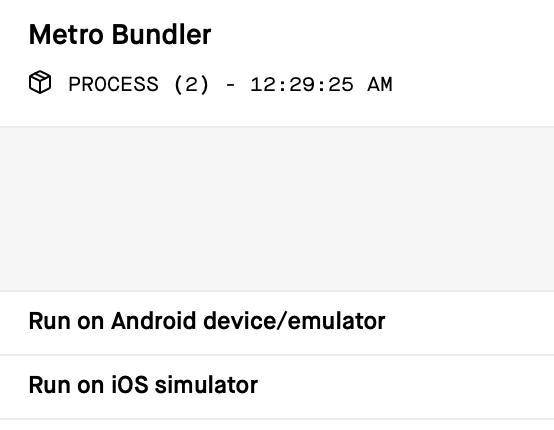
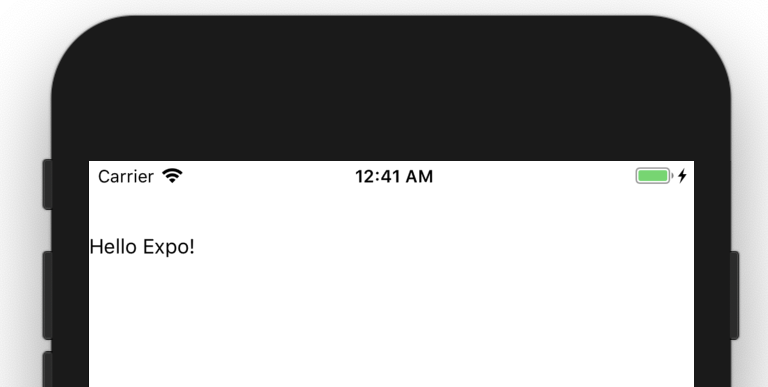

This article shows the steps to create a minimal Expo project. The project uses TypeScript and Jest. Note that this procedure is based on Expo SDK31 and may be invalid in the future.

### Install Expo CLI

As described in [the official doc](https://docs.expo.io/versions/v31.0.0/introduction/installation), let's install the CLI tool.

```bash
$ npm install -g expo-cli
```

> Note: I prefer using `npx` and I use `npx` in my project, but `expo-cli` depends on `@expo/dev-tools` which depends on old `graphql`. It's just safer to do global install unless you know the issues that could arise.

### Initialize a project

First, simply use the Expo CLI to initialize a project.

```bash
$ expo init my-expo-project
```

Select "blank" for a template. If it's finished, go into the directory.

```bash
$ cd my-expo-project
```

### Minimize the project

If you look at [the doc about app.json](https://docs.expo.io/versions/v31.0.0/workflow/configuration), the required fields are "name", "slug", and "sdkVersion", but I found "version" is also mandatory. You can safely remove other fields for the start. The resulting `app.json` is the following.

```json
{
  "expo": {
    "name": "my-expo-project",
    "slug": "my-expo-project",
    "sdkVersion": "31.0.0",
    "version": "1.0.0"
  }
}
```

Since we use TypeScript, we don't need babel. The following commands remove it.

```bash
$ rm babel.config.js
$ npm uninstall -D babel-preset-expo
```

We also remove `App.js` (by `rm App.js`) and create `App.ts`. We want to store files in the `src` directory and `App.ts` is just an entry point for that.

```javascript
import App from './src/App';
export default App;
```

Finally, create the `src` directory (by `mkdir src`) and create `App.tsx`. The simplest one would be like this:

```jsx
import * as React from 'react';
import { Text, View } from 'react-native';

export default () => (
  <View style={{ marginTop: 50 }}>
    <Text>Hello Expo!</Text>
  </View>
);
```

One more thing. We need to create config files for TypeScript. These may vary based on requirements, but I would like to have something minimal based on the [handbook](https://www.typescriptlang.org/docs/handbook/tsconfig-json.html). The `tsconfig.json` file for this project is:

```json
{
  "compilerOptions": {
    "target": "es5",
    "lib": ["es2015", "esnext.asynciterable"],
    "jsx": "react-native",
    "strict": true,
    "noUnusedLocals": true,
    "noUnusedParameters": true,
    "types": [
      "jest"
    ]
  }
}
```

We also use [tslint](https://palantir.github.io/tslint/) and the `tslint.json` file for this project is:

```json
{
  "extends": [
    "tslint:recommended",
    "tslint-config-airbnb"
  ],
  "rules": {
    "no-any": true,
    "prefer-array-literal": [true, { "allow-type-parameters": true }],
    "variable-name": [true, "ban-keywords", "check-format", "allow-pascal-case", "allow-leading-underscore"]
  }
}
```

> This includes some of my preferences, especially `no-any`. Feel free to change it as you want.

To make it work, we need to install TypeScript dependencies.

```bash
$ npm install -D typescript tslint tslint-config-airbnb @types/expo @types/react
```

### Running the app

By now, we can run the app by the following command.

```bash
$ npm start
```

This will open up Expo Dev Tools in your browser. (Type "d" in your console, if it doesn't open.)



Click the "Run on emulator/simulator" or open it in your phone with Expo App. You will see something like this.



This looks minimal, doesn't it?

### Adding Jest

We then add Jest for writing tests. Let's install dependencies.

```bash
$ npm install -D jest jest-expo ts-jest react-test-renderer @types/jest @types/react-test-renderer
```

What is tricky is the jest configuration. So far, the following config in the "package.json" file seems to work.

```json
  "jest": {
    "preset": "jest-expo",
    "transform": {
      "^.+\\.js$": "<rootDir>/node_modules/react-native/jest/preprocessor.js",
      "^.+\\.tsx?$": "ts-jest"
    },
    "testMatch": [
      "**/__tests__/**/*.ts?(x)",
      "**/?(*.)+(spec|test).ts?(x)"
    ],
    "moduleFileExtensions": [
      "js",
      "ts",
      "tsx"
    ],
    "globals": {
      "ts-jest": {
        "tsConfig": {
          "jsx": "react"
        }
      }
    }
  }
```

This doesn't look minimal and not very satisfying. Hope it to be improved. As for the "globals" part, see [the doc](https://kulshekhar.github.io/ts-jest/user/config/#ts-jest-options) for more information.

Let's write a snapshot test for `App.tsx`. This is the file `App.spec.tsx` in `src`.

```jsx
import * as React from 'react';
import * as renderer from 'react-test-renderer';

import App from './App';

describe('App', () => {
  it('snapshot test', () => {
    const tree = renderer.create(
      <App />,
    ).toJSON();
    expect(tree).toMatchSnapshot();
  });
});
```

We add npm scripts to ease running tests, including TypeScripts tests.

```json
  "scripts": {
    "start": "expo start",
    "android": "expo start --android",
    "ios": "expo start --ios",
    "test": "npm run tslint && npm run tsc-test && npm run jest",
    "tslint": "tslint --project .",
    "tsc-test": "tsc --project . --noEmit",
    "jest": "jest"
  },
```

With this, we can run test simply by:

```bash
$ npm test
```

The result would be something like this:

```bash
...
 PASS  src/App.spec.tsx
  App
    ✓ snapshot test (445ms)

 › 1 snapshot written.
Snapshot Summary
 › 1 snapshot written from 1 test suite.

Test Suites: 1 passed, 1 total
Tests:       1 passed, 1 total
Snapshots:   1 written, 1 total
Time:        4.707s
Ran all test suites.
```

### Real working example

In this article, we explained the rough procedure to create a minimal Expo app. Some part of the procedure might not be very descriptive enough, and you may find some difficulties reproducing it. The repository below is my project based on what is described in this article.

https://github.com/dai-shi/typescript-expo-apollo-boilerplate

Please check it out if you want to try a real working example. Notice that the goal of this boilerplate is to support the use of React Apollo GraphQL in addition to TypeScript and Jest.
