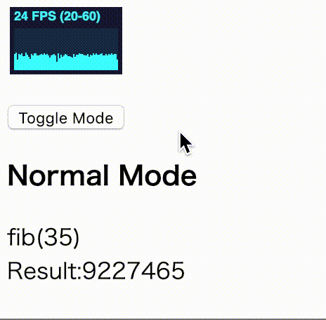

### Introduction

React Hooks is something I've been working on lately. What's wonderful is creating custom hooks. If you encapsulate logic nicely in a hook, it can be shared among components and used intuitively. You can find my custom hooks in [my GitHub repos](https://github.com/dai-shi), some of which are very experimental.

This time, my experiment is to combine React Hooks and Web Workers. I know it's not too difficult, but let me explain a bit in this short article.

### The custom hook

Let me first introduce the library. It's called "react-hooks-worker". We won't go into details about the implementation, but it's pretty simple. Check out the code if you are interested.

https://github.com/dai-shi/react-hooks-worker

### How to use it

You first need a worker script. It's somewhat a different way of writing, compared to scripts for browsers. Basically, it receives a message and sends a message. Messages are typically serializable. Note that message passing does not have to be a request/response style.

```javascript
const fib = i => (i <= 1 ? i : fib(i - 1) + fib(i - 2));

self.onmessage = (e) => {
  const count = e.data;
  self.postMessage(fib(count));
};
```

The above code is to receive a number, calculate a fibonacci number and send it back. Notice this "fib" is a slow version of the algorithm.

Now, we want to call this function from React components.

```jsx
import React from 'react';
import ReactDOM from 'react-dom';

import { useWorker } from 'react-hooks-worker';

const CalcFib = ({ count }) => {
  const { result, error } = useWorker('./slow_fib.js', count);
  if (error) return <div>Error:{error}</div>;
  return <div>Result:{result}</div>;
};

const App = () => (
  <div>
    <CalcFib count={5} />
  </div>
);

ReactDOM.render(<App />, document.getElementById('app'));
```

This is everything. The count is just `5` in this code, but you can change it and pass it to `CalcFib`.

### Comparison

I want to compare how a web worker works with the normal JS main thread, and made a small example to run the same code. The below is a screencast.



On the top left is a FPS chart. The web worker mode doesn't drop the rate, but the normal mode does. You can try it by yourselves. Just open the following link.

[react-hooks-worker-example - CodeSandbox](https://codesandbox.io/s/github/dai-shi/react-hooks-worker/tree/master/examples/03_comparison)

The code is in the repository [here](https://github.com/dai-shi/react-hooks-worker/tree/master/examples/03_comparison).

### Some final notes

I'm not very satisfied with the current API of the custom hook. It might not be well encapsulated. It's not very UX oriented either, for example, we might want an easy way to show "Loading..." for a request/response style invocation.

Feedbacks including possible use cases are welcome to give any hints to improve the library.
