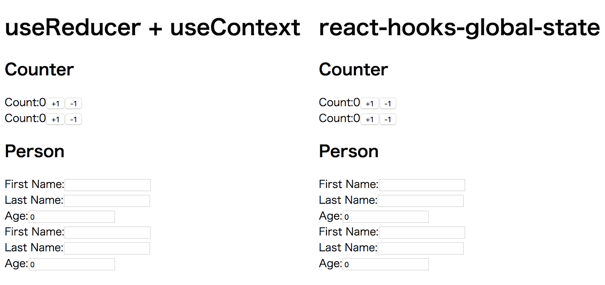
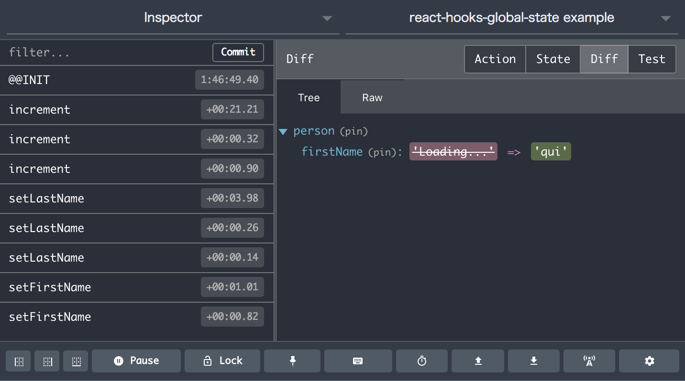

In this article, I will first explain minimal code to implement global state with useReducer and useContext which are called "hooks" that will be available in React 16.7. I will then compare it with [react-hooks-global-state](https://github.com/dai-shi/react-hooks-global-state) which is a tiny library that I've been developing for global state management primarily for small applications.

Note: Global state is convenient for sharing values among components far apart in the component tree, but it shouldn't be abused because it would limit the reusability. Consider if values could be simply passed as props down the component tree.

### Pure useReducer + useContext example without any libraries

Let's look at the code. It's written in TypeScript. My TypeScript preference is enabling the strict mode, more precisely with `noImplicitAny` and `noAny`(tslint). I'm pretty interested in writing code in TypeScript without type annotations as much as possible which would just look like normal JavaScript.

The following is the application specific part, and initialState and reducer are defined. The file is simply named "common.ts" as it's also used in the next section.

```javascript
export const initialState = {
  counter: 0,
  person: {
    age: 0,
    firstName: '',
    lastName: '',
  },
};

export type State = typeof initialState;

export type Action =
  | { type: 'increment' }
  | { type: 'decrement' }
  | { type: 'setFirstName', firstName: string }
  | { type: 'setLastName', lastName: string }
  | { type: 'setAge', age: number };

export const reducer = (state: State, action: Action) => {
  switch (action.type) {
    case 'increment': return {
      ...state,
      counter: state.counter + 1,
    };
    case 'decrement': return {
      ...state,
      counter: state.counter - 1,
    };
    case 'setFirstName': return {
      ...state,
      person: {
        ...state.person,
        firstName: action.firstName,
      },
    };
    case 'setLastName': return {
      ...state,
      person: {
        ...state.person,
        lastName: action.lastName,
      },
    };
    case 'setAge': return {
      ...state,
      person: {
        ...state.person,
        age: action.age,
      },
    };
    default: return state;
  }
};
```

The code above should be familiar to people who have used Redux before. The type definition is unfortunately included just because we define it in a separate file.

Next, we define a Provider component and two hooks, in a file named "state2.tsx".

```jsx
import * as React from 'react';

import { Action, initialState, reducer, State } from './common';

const { createContext, useContext, useReducer } = React;

const stateCtx = createContext(initialState);
const dispatchCtx = createContext((() => 0) as React.Dispatch<Action>);

export const Provider: React.ComponentType = ({ children }) => {
  const [state, dispatch] = useReducer(reducer, initialState);
  return (
    <dispatchCtx.Provider value={dispatch}>
      <stateCtx.Provider value={state}>
        {children}
      </stateCtx.Provider>
    </dispatchCtx.Provider>
  );
};

export const useDispatch = () => {
  return useContext(dispatchCtx);
};

export const useGlobalState = <K extends keyof State>(property: K) => {
  const state = useContext(stateCtx);
  return state[property]; // only one depth selector for comparison
};
```

In this "state2.tsx", we use two contexts for state itself and dispatch function. Notice two tweaks for type annotations for the default dispatch value and the argument of useGlobalState. (Feedback appreciated. I'm still a beginner in TypeScript.)

The use of hooks should be easy. For example, this is "Counter2.tsx". Notice `useCallback` for optimization which could be omitted if child components don't rely on shallow comparing.

```jsx
import * as React from 'react';

import { useDispatch, useGlobalState } from './state2';

const { useCallback } = React;

const Counter = () => {
  const value = useGlobalState('counter');
  const dispatch = useDispatch();
  const increment = useCallback(() => dispatch({ type: 'increment' }), [dispatch]);
  const decrement = useCallback(() => dispatch({ type: 'decrement' }), [dispatch]);
  return (
    <div>
      <span>Count: {value}</span>
      <button type="button" onClick={increment}>+1</button>
      <button type="button" onClick={decrement}>-1</button>
    </div>
  );
};

export default Counter;
```

To make this work, we need to put `Provider` up in the component tree, probably the top, something like the following code.

```jsx
import * as React from 'react';

import Counter2 from './Counter2';
import { Provider } from './state2';

const App = () => (
  <Provider>
    <h2>Counter</h2>
    <Counter2 />
    <Counter2 />
  </Provider>
);

export default App;
```

Quite simple, isn't it? Now, let's see the other example.

### react-hooks-global-state

The previous section explains a "pure" example. In this article, "pure" simply means no third-party library. The example code in this section uses the library.

https://github.com/dai-shi/react-hooks-global-state

The file "common.ts" is exactly the same as the previous example, and the "state.ts" file with this library is the following.

```javascript
import { createStore } from 'react-hooks-global-state';
import { initialState, reducer } from './common';

export const { GlobalStateProvider, dispatch, useGlobalState } = createStore(reducer, initialState);
```

Could it be simpler than this? The power of custom hooks, thanks to the React team.

The "Counter.tsx" file below is slightly different from the "Counter2.tsx" above because useGlobalState returns an array, and the dispatch function is available globally.

```jsx
import * as React from 'react';

import { dispatch, useGlobalState } from './state';

const increment = () => dispatch({ type: 'increment' });
const decrement = () => dispatch({ type: 'decrement' });

const Counter = () => {
  const [value] = useGlobalState('counter');
  return (
    <div>
      <span>Count: {value}</span>
      <button type="button" onClick={increment}>+1</button>
      <button type="button" onClick={decrement}>-1</button>
    </div>
  );
};

export default Counter;
```

### The working example

You can try running these examples working side by side.

```bash
git clone https://github.com/dai-shi/react-hooks-global-state.git
cd react-hooks-global-state
npm install
npm run examples:comparison
```

Open http://localhost:8080 and you will see something like this.



### Comparison notes

Let me breifly explain differences of two approaches with some backgrounds that can't be seen in the examples. Note that I'm a bit biased, of course. In this section, (A) denotes the first approach without any third-party libraries, and (B) denotes the second approach with react-hooks-global-state.

1. One obvious difference is (B) requires less code just because the library provides common code. Whereas, (A) doesn't require any libraries and you have control of everything. It depends on developers whether they want more control or more opinionated restriction.
2. (A) uses `useDispatch` to get `dispatch` function, while (B) has a global `dispatch` imported from 'state.ts'. It might not be good for code reusability unless you carefully split code for reusable one and the one that depends on a variable outside, but it allows to define actions (functions that return action objects) in component files without caring about memoization, which could be easier for beginners. Because this approach is contradictory to action creators in Redux, there might be other drawbacks.
3. (B) is rather for smaller applications, specializing for "one depth selector", and it makes the use of `observedBits`. In the examples of previous sections, if you click "+1" to increment the counter, the Counter component is re-rendered in both (A) and (B); however, while the Person component is also re-rendered in (A), it is not so in (B). In order to avoid re-rendering in (A), you need to use the memoization technique which shouldn't be too difficult with `React.memo` or `useMemo`, but it's still difficult for beginners. In the case you need "deep selector", you need memoization or something (bail out?) both in (A) and (B), so there's no reason to pick (B) as it has an extra cost for the "one depth selector" specialization.

As a side note, react-hooks-global-state has two styles of the usage. One is the setState style `createGlobalState` and the other is the reducer style `createStore`. In this article, we only explain about `createStore`, but the primary motivation of this library is `createGlobalState`, which is much simpler. In contrast, `createStore` has more capabilities including naive Redux middleware support and hacky Redux DevTools Extention support. See [the working example](https://github.com/dai-shi/react-hooks-global-state/tree/master/examples/08_thunk) if you are interested.



### A final note

I like Redux, and if I need the full Redux feature, I would use Redux. I hope `react-redux` provides nice custom hooks some time soon. The library react-hooks-global-state is probably for smaller use cases, or complementary to other libraries like React Apollo. Will see...

React hooks are still not yet released as of writing. Until then, this is still an experimental project.

### Changelog

- _[2018-11-10]:_ Initial publication.
- _[2018-11-11]:_ Use useCallback for optimization.
- _[2018-11-12]:_ The library API is changed again based on the Context API. Comparison notes are rewritten.
