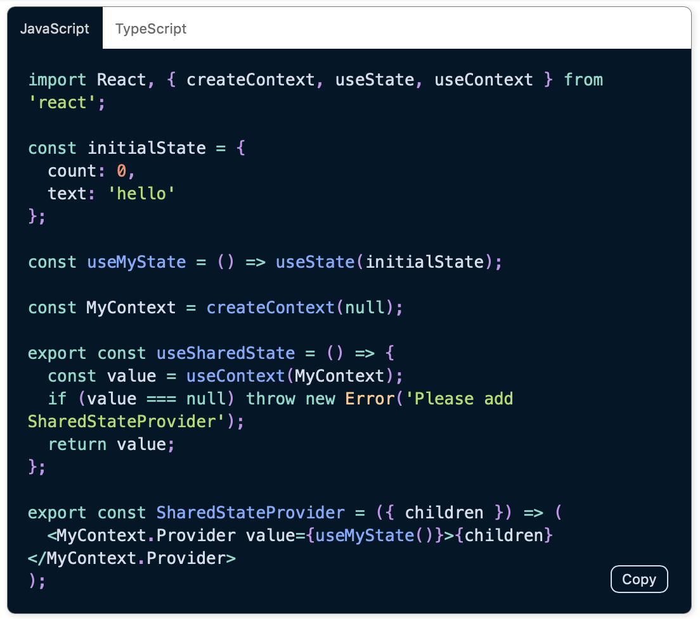

### Introduction

I have been developing a React Hooks library called React Tracked.
This is the library I put much effort lately as well as
my other libraries.

<https://github.com/dai-shi/react-tracked>

This library solves a performance issue with React Context.
For those who are interested in the fundamental problem,
please take a look at [the long issue](https://github.com/facebook/react/issues/14110).

What's notable in this library is that
it doesn't provide any new fancy features.
You can simply replace Context.Provider and useContext
with the custom ones, it just works with performance.

Because it doesn't provide any fancy features,
how would I tell the benefit of the library
for those who don't know the problem yet?
This is my motivation for starting a new documentation website.

The documentation website is up and running:

<https://react-tracked.js.org>

### Docusaurus

[Docusaurus](https://docusaurus.io) is one of the popular
documentation tools. It's used by many projects like Create React App,
Redux families, Jest and so on.
Docusaurus is planning to release v2 soon,
and that sounds promising.
If I were to create a new website, why would I not use the new tool?

It turns out that v2 is pretty simple to configure.
What you need is only three files at the minimum.

- `docusaurus.config.js` to configure some basic stuff
- `sidebars.js` to configure the markdown documents
- `src/pages/index.js` to create the main page

I'm not really sure if this is the correct way at this point.
We should soon have better Docusaurus documentation.
If you are interested in how I configured it, check out
[the repo](https://github.com/dai-shi/react-tracked/tree/5469f0bafa5794a0aa69f4d084365061e9383771/website).

### A custom plugin

There's something I want to do at this point.
I don't want to create code snippets
for both JavaScript and TypeScript.
The JavaScript snippet could be generated from the TypeScript snippet.
So, I developed a small plugin (theme) to do that on the fly.

The result is pretty neat.
Here's a code snippet in markdown.

````markdown
```typescript ts2js
import React, { createContext, useState, useContext } from 'react';

const initialState = {
  count: 0,
  text: 'hello',
};

const useMyState = () => useState(initialState);

const MyContext = createContext<ReturnType<typeof useMyState> | null>(null);

export const useSharedState = () => {
  const value = useContext(MyContext);
  if (value === null) throw new Error('Please add SharedStateProvider');
  return value;
};

export const SharedStateProvider: React.FC = ({ children }) => (
  <MyContext.Provider value={useMyState()}>
    {children}
  </MyContext.Provider>
);
```
````

Just with this, the website shows something like the following.



If you click the "TypeScript" tab, the TypeScript snippet will be shown.

A small hint implementing this is that because "tsc" doesn't preserve spaces,
prettier is used to re-format the snippet.

If this were something valuable, we might consider publishing
it as an installable plugin.
In the meantime, you can check out [the code](https://github.com/dai-shi/react-tracked/tree/5469f0bafa5794a0aa69f4d084365061e9383771/website/custom_modules/docusaurus-theme-ts2js-codeblock).

To be honest, I would like to do it at the build time.
That would probably require developing a plugin instead of a theme.

### Logo

Well, can you imagine a documentation website without a logo?
So I created the logo. I hope the website is good looking now.

### Discord

Many OSS projects have community channels.
I think it's a good timing to start at least one.
So I made a Discord server. The invitation link is [here](https://discord.gg/MrQdmzd).

### Summary

Again, the React Tracked documentation website is available at:

<https://react-tracked.js.org>

Please visit there to learn React Tracked and/or Docusaurus v2.
Hope you like it. Feedback are welcome in the Discord channel or other means.

My plan is to add more contents in the website.
It would be important to understand what people want to know.
Would someone help on it?
